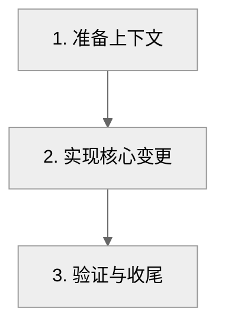

# Plan Gen — 需求计划生成 Skill

根据用户需求生成或维护结构化 Markdown 计划文件。计划用于指导后续实现，
本 skill 只生成和更新计划文档，不执行计划中的代码改动。

---

## 职责分工

| 角色 | 职责 | 做 | 不做 |
|------|------|----|------|
| **主 agent** | 编排与调度 | 解析指令、确定模式、确认少量必要信息、启动子 agent、检查结果、输出文件清单 | 深入分析项目、生成完整计划正文、修改业务代码 |
| **子 agent** | 执行具体任务 | 读取必要上下文、分析需求、拆解任务、生成/更新计划文件、返回结构化结果 | 调度决策、执行计划中的代码实现 |

所有子 agent 统一使用 `subagent_type: general-purpose`。

---

## 指令总览

| 指令 | 功能 |
|------|------|
| `create [需求描述]` | 根据需求生成新的计划文件 |
| `update [计划文件] [变更说明]` | 更新已有计划文件 |
| `help` | 输出简要帮助 |

---

## 通用规范

### 1. 交互原则

- 优先从用户指令中提取需求、目标文件、输出路径和验证方式。
- 信息足够时直接生成计划，不要逐项询问。
- 只在缺少关键输入且无法合理默认时提问；一次最多问 3 个问题。
- 默认输出目录为项目根目录下的 `plan/`。
- 默认验证方式为“人工审查 + 相关测试/检查命令（如项目中存在）”。
- 默认最大并行子 agent 数为 `3`；计划中允许并行的任务不得超过该值。

### 2. 输出路径与命名

- `_planPath`：计划输出目录，默认 `{projectRoot}/plan`。
- 路径不存在时自动创建。
- 文件名使用中文短标题，格式为 `{需求主题}实施计划.md`。
- 同名文件已存在时，优先创建带序号的新文件，除非用户明确要求覆盖。
- 同一会话中记住 `_planPath`。

### 3. 时间与文件操作

- 文档顶部标注 `YYYY-MM-DD HH:mm` 格式的上次修改时间。
- 时间必须通过操作系统日期命令获取，不得由 agent 自行推断。
- 只允许创建或修改计划文档及必要的 `plan/` 目录。
- 禁止修改、创建、删除计划以外的业务代码、配置、测试或文档文件。

### 4. 计划质量标准

计划必须满足：

- **目标明确**：一句话说明最终要达成的结果。
- **范围清楚**：列出包含范围、非目标和假设。
- **顺序可执行**：步骤按实现顺序排列，依赖关系明确。
- **验收可验证**：每步都有验收标准和验证方式。
- **边界可控**：列出风险、回滚方案、需要用户确认的事项。
- **适合 AI 执行**：每步足够小，后续 agent 可以按步骤逐项完成。

### 5. 并发规则

- 默认 `_maxConcurrency=3`。
- 步骤默认线性执行：上一步完成并验证后再进入下一步。
- 只有无依赖关系的任务才能标记为可并行。
- 同一批并行任务数量不得超过 `_maxConcurrency`。
- 计划中必须明确每个步骤的依赖步骤；无依赖写 `无`。

### 6. 画图约定

仅在需求涉及流程、状态、架构或模块依赖时生成 Mermaid 图。每个 Mermaid 代码块首行插入：

```text
%%{init: {"theme": "neutral"}}%%
```

| 场景 | 优先使用 | 兜底 |
|------|----------|------|
| 调用流程/交互 | `sequenceDiagram` | 文字流程 |
| 状态流转 | `stateDiagram-v2` | 状态表 |
| 实施流程 | `flowchart` | 步骤列表 |
| 架构/模块依赖 | `graph` | 层次列表 |

Mermaid 规则：

- 节点标签含 `( )` `[ ]` `{ }` `"` `:` 等特殊字符时，用双引号包裹。
- 名称含空格/特殊字符的 participant 使用 `as` 起别名。
- 禁用 HTML 标签；换行使用 `\n` 或 `</br>`。
- 写入后自查语法，最多修复 5 次；仍失败则改用兜底文本。

### 7. 跨子 agent 变量

| 变量 | 含义 | 设置时机 |
|------|------|----------|
| `_planPath` | 计划输出目录（绝对路径） | create/update 步骤 1 |
| `_timeStr` | 当前时间字符串 `YYYY-MM-DD HH:mm` | 每次文件写入前 |
| `_maxConcurrency` | 最大并行子 agent 数量，默认 3 | create 步骤 1 |
| `_verifyMethod` | 验证方式描述 | create/update 步骤 1 |
| `_planFileName` | 计划文件名 | create/update 步骤 1 |

---

## 计划文件模板

生成计划文件时使用以下结构，按需求裁剪但不要删除核心章节：

````markdown
# {标题}
> 上次修改：{_timeStr}

## 目标
一句话描述本计划要达成的结果。

## 背景与需求
- 用户原始需求摘要
- 当前上下文或相关模块
- 关键约束

## 范围
### 包含
- ...

### 不包含
- ...

### 假设
- ...

## 实施流程


## 实施步骤
| 步骤 | 任务 | 依赖 | 可并行 | 涉及文件/模块 | 执行内容 | 验收标准 | 验证方式 | 回滚方案 |
|------|------|------|--------|---------------|----------|----------|----------|----------|
| 1 | 任务名 | 无 | 否 | 路径/模块 | 做什么 | 如何判断完成 | 命令/人工审查 | 如何撤回 |

## 风险与应对
| 风险 | 影响 | 应对 |
|------|------|------|
| ... | ... | ... |

## 待确认事项
- 无

## 执行记录
| 时间 | 步骤 | 状态 | 说明 |
|------|------|------|------|
````

---

## `create` — 生成计划

### 执行流程

1. **确定输入与默认值**：
   - 从指令中提取 `requirement`、`_planPath`、`_verifyMethod`、`_maxConcurrency`。
   - 未指定 `_planPath` 时使用项目根目录下的 `plan/`。
   - 未指定 `_verifyMethod` 时使用默认验证方式。
   - 未指定 `_maxConcurrency` 时使用 `3`。
   - 通过操作系统日期命令获取 `_timeStr`。
   - 根据需求生成 `_planFileName`。

2. **启动计划生成子 agent**：

   ```
   Agent:
     description: 分析需求并生成计划
     prompt: |
       根据以下需求生成结构化计划文件。

       需求描述：
       {requirement}

       输出路径：{_planPath}
       文件名：{_planFileName}
       当前时间：{_timeStr}
       验证方式：{_verifyMethod}
       最大并行子 agent 数：{_maxConcurrency}

       要求：
       1) 只创建计划文档，不修改业务代码、配置、测试或其他项目文件。
       2) 读取必要项目上下文，识别相关模块、文件和约束；上下文不足时在“待确认事项”中记录。
       3) 按实现顺序拆解任务，默认线性推进；只有无依赖任务才标记可并行。
       4) 每个步骤必须包含依赖、涉及文件/模块、执行内容、验收标准、验证方式、回滚方案。
       5) 如需求涉及流程、状态或架构，生成 Mermaid 图并校验语法。
       6) 控制步骤粒度，避免一个步骤同时覆盖多个独立改动。
       7) 写入 {_planPath}/{_planFileName}。

       返回 JSON：
       {
         "filePath": "{_planPath}/{_planFileName}",
         "title": "...",
         "stepCount": 0,
         "maxConcurrency": {_maxConcurrency},
         "requiresConfirmation": ["..."],
         "risks": ["..."]
       }
   ```

3. **检查结果并输出**：

   ```
   create 完成：
     - 创建 {_planFileName}（共 {stepCount} 个实施步骤，最大并发 {_maxConcurrency}）
   ```

---

## `update` — 更新计划

### 执行流程

1. **确定目标计划文件**：
   - 用户指定文件时直接使用。
   - 未指定时列出 `_planPath` 下 `.md` 文件并让用户选择。
   - 通过操作系统日期命令获取 `_timeStr`。

2. **启动更新子 agent**：

   ```
   Agent:
     description: 更新计划文件
     prompt: |
       更新计划文件 {_planPath}/{targetFile}。

       当前时间：{_timeStr}
       需求变更：{changes}
       验证方式：{_verifyMethod}

       操作规范：
       1) 只修改目标计划文件，不修改业务代码。
       2) 读取当前计划，保留已有有效信息、状态和执行记录。
       3) 根据需求变更更新目标、范围、实施步骤、风险、待确认事项。
       4) 已完成步骤不得重写为未完成；如变更影响已完成步骤，在风险或待确认事项中说明。
       5) 新增步骤必须补齐依赖、验收标准、验证方式和回滚方案。
       6) 更新上次修改时间为 {_timeStr}。
       7) 保存文件。

       返回 JSON：
       {
         "filePath": "{_planPath}/{targetFile}",
         "updatedSections": ["..."],
         "addedSteps": 0,
         "requiresConfirmation": ["..."]
       }
   ```

3. **输出结果**：

   ```
   update 完成：
     - 更新 {targetFile}
   ```

---

## `help` — 查看帮助

```
/plan-gen create [需求描述]          — 根据需求生成计划文件
/plan-gen update [文件] [变更说明]  — 更新已有计划文件
/plan-gen help                      — 查看本帮助
```

---

## 注意事项

1. **计划边界**：本 skill 只生成和维护计划文档，不执行计划中的代码实现。
2. **少问问题**：能从指令或项目上下文推断的内容直接默认；必要问题一次最多 3 个。
3. **路径自动创建**：`plan/` 目录不存在时自动创建。
4. **时间真实来源**：写入时间必须通过系统日期命令获取。
5. **状态保留**：更新计划时保留已有执行状态和执行记录。
6. **子 agent 容错**：子 agent 返回 null 或无效 JSON 时，记录失败并告知用户。
