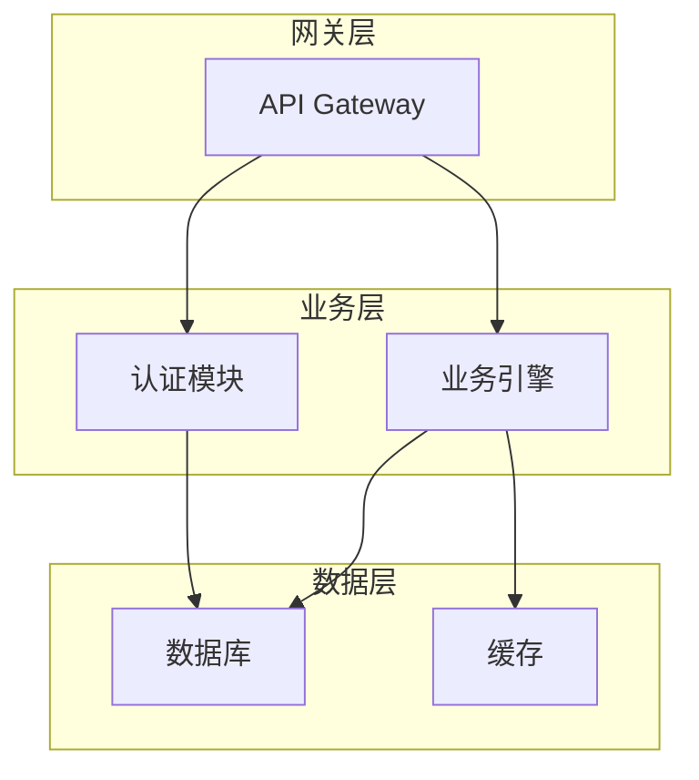
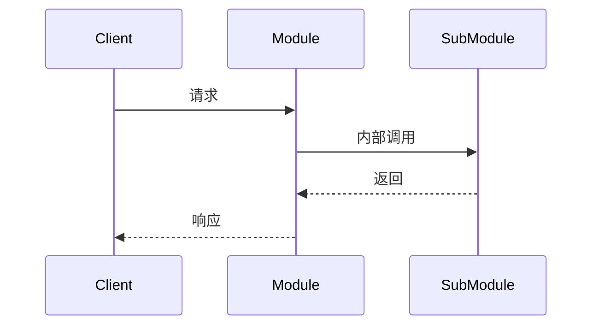
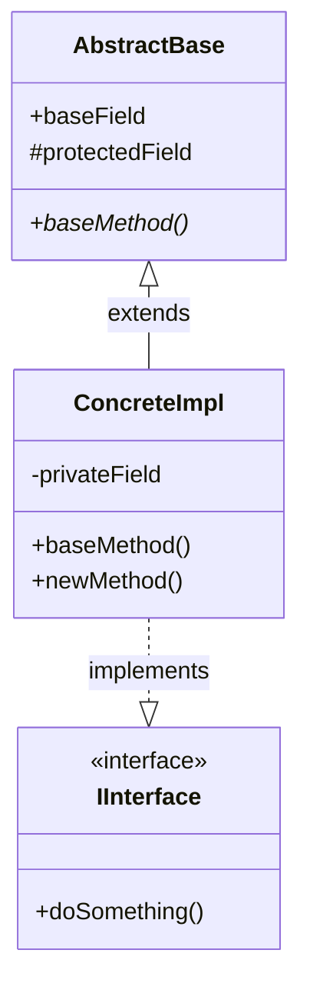
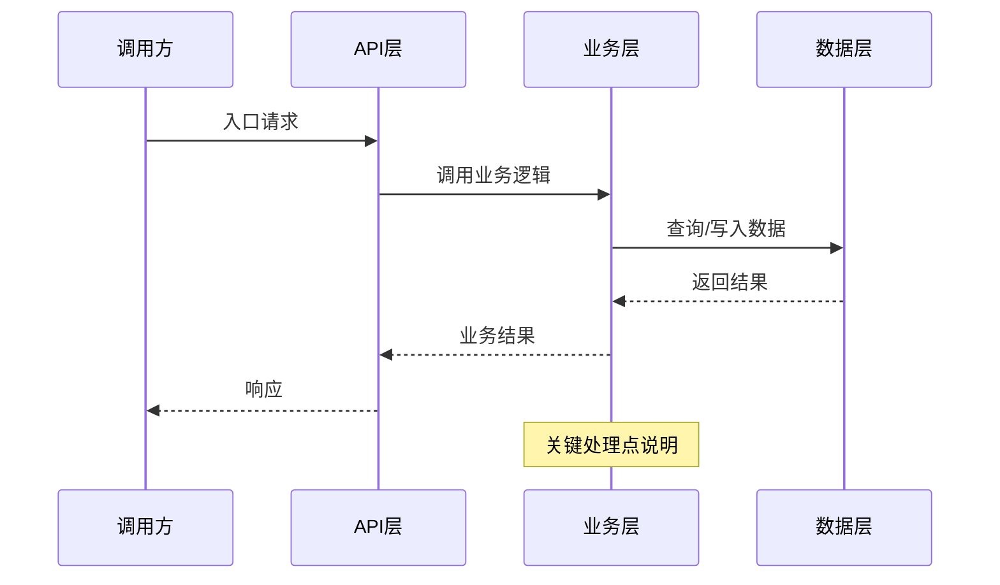

# Source Code Read — 源码阅读与文档生成 Skill

本 Skill 提供五个指令用于系统性地阅读和分析源码项目，并生成结构化文档。

---

## 指令总览

| 指令 | 功能 |
|------|------|
| `/source-code-read init` | 首次分析：归纳项目模块并生成完整文档 |
| `/source-code-read reinit` | 基于已有文档重新分类、补充、整理 |
| `/source-code-read update` | 增量更新：按需补充或修改已有文档 |
| `/source-code-read byCase` | 按场景/概念追溯源码，生成时序图和实现分析 |
| `/source-code-read help` | 查看详细帮助和示例 |

---

## 通用规范

### 画图约定

skill 中所有涉及画图场景，**统一优先使用 Mermaid 绘制**。Mermaid 在 GitHub、GitLab、VS Code 等编辑器中原生渲染，无需额外工具。

支持的图类型及优先级：

| 场景 | 优先使用 | 兜底方案 |
|------|----------|----------|
| 类继承/接口实现 | ` ```mermaid` classDiagram | 文本 UML |
| 调用流程/交互 | ` ```mermaid` sequenceDiagram | 文字流程描述 |
| 状态流转 | ` ```mermaid` stateDiagram-v2 | 文字状态表 |
| 流程图/算法逻辑 | ` ```mermaid` flowchart | 步骤列表 |
| 架构/模块依赖 | ` ```mermaid` graph | 层次列表 |
| 甘特图/时间线 | ` ```mermaid` gantt | 表格 |
| 内存布局/结构体对齐 | ` ```text` 标注高/低地址 | — |

### 文档生成规范

1. **日期标注**：每个文档**最前面**必须列出上次修改日期，精确到**分钟**，格式 `YYYY-MM-DD HH:mm`。

2. **文档命名**：
   - 所有文档名称使用**中文**（如 `认证模块.md`、`核心引擎.md`、`数据持久化.md`）。
   - **术语表**等需要保留原文的文档例外（如 `术语表.md`）。

3. **IDE 优先**：读取源码前，检测 JetBrains IDE MCP 工具（`ide_index_status` 等）是否可用。如果可用，通过 IDE 获取项目配置和环境信息而非 Bash 环境变量；否则回退到 Bash。

4. **代码引用**：所有引用的代码路径在文档末尾统一列出。
   - 在本工程内的代码使用**相对路径**（相对于工程根目录）
   - 超出本工程的代码（如第三方库、系统库）使用**绝对路径**

5. **概念解释**：每个概念必须包含：
   - 清晰的定义
   - 为什么需要它（解决的问题）
   - 至少一个代码示例或使用场景

6. **重点关注**：在每个文档**开头**列出需要重点关注的章节（使用 checkbox 列表），帮助读者快速定位。

7. **三维评估**：关键代码不能只列名词或摘要，必须从三个维度分析：
   - **好处**：为什么这么做？性能/可维护性/兼容性等优势
   - **替代方案**：其他实现方式及各自权衡
   - **风险**：不这么实现可能引发的问题

8. **摘要同步**：任何指令（`init` / `reinit` / `update` / `byCase` 等）在执行中如果**新增文档、删除文档或修改了文档名称**，必须同步更新 `{_path}/摘要.md`：
   - 新增文档 → 在"模块功能摘要"表中添加对应条目
   - 删除文档 → 从表中移除对应条目
   - 文档改名 → 更新表中文档链接
   - 文档内容大改 → 更新摘要中对应模块的描述

---

## `init` — 首次初始化和文档生成

### 执行流程

#### 步骤 1：确认输出目录

- **首次会话（无记忆）**：向用户询问输出文档的**绝对路径**，记为 `_path`。
- **检查 `_path`**：
  - 如果 `_path` 不存在，则创建目录。
  - 如果 `_path` 下已有文件，列出文件列表并询问用户是否继续使用该路径。
  - 如果用户选择不使用，则重新询问新路径。
- **记住 `_path`**：在本次会话中记住该路径，`update` / `reinit` 指令可直接沿用。

#### 步骤 2：读取源码 — 环境信息获取

在读取源码之前，判断当前工程是否正在被 IDE（如 JetBrains IntelliJ/CLion/GoLand）打开：

1. **检测 IDE**：检查当前会话是否存在 `ide_index_status` 等 JetBrains IDE MCP 工具。
2. **如果 IDE 工具可用**：
   - 使用 IDE 中的当前工程配置来获取环境信息（JDK/Go SDK/Node 版本、项目 SDK、构建工具配置等），而不是依赖 Bash 的环境变量。
   - 可通过 `ide_search_text` 或相关工具读取 IDE 项目配置文件（如 `.iml`、`build.gradle`、`pom.xml` 等）。
3. **如果 IDE 工具不可用**：
   - 回退到 Bash 环境变量和文件系统分析。

#### 步骤 3：项目全局分析

深入分析项目整体，生成以下信息写入 `摘要.md`：

**文档位置：`{_path}/摘要.md`**

```markdown
# {项目名称} 源码阅读指南

> 上次修改：2026-06-06 15:30

## 项目概览

- **项目名称**：（从项目元数据推断）
- **技术栈**：语言、框架、构建工具、运行时、数据库等
- **构建方式**：构建命令、环境要求、配置文件路径
- **项目规模**：总文件数、代码行数（估算）、模块数
- **许可证**：如可识别

## 模块功能摘要

| 模块/目录 | 主要功能 | 核心文件 | 文档链接 |
|-----------|----------|----------|----------|
| module-a  | xxx 功能  | main.py  | [认证模块.md](./认证模块.md) |
| module-b  | xxx 功能  | core.go  | [核心引擎.md](./核心引擎.md) |

## 源码阅读建议

- **阅读顺序**：建议按什么顺序阅读各模块
- **重点章节**：本节列出各文档中最值得关注的关键章节
- **预备知识**：需要了解哪些前置概念
- **调试技巧**：如何运行和调试项目
- **扩展阅读**：推荐进一步了解的内容

## 架构总览

（优先使用 Mermaid graph 绘制项目架构图/模块依赖图，示例：）


```

#### 步骤 4：逐个模块分析

对项目的每个主要模块/目录，生成独立的 Markdown 文档。**文档名称使用中文**（术语相关文档除外，如 `术语表.md`）。

**文档位置：`{_path}/{中文模块名称}.md`**

文档结构如下：

```markdown
# {模块名称} 分析

> 上次修改：2026-06-06 15:30
> 本文档对应目录：`src/{module-path}/`

## 重点关注
- [ ] 核心概念 &1
- [ ] 关键流程 &2
- [ ] 设计模式 &3
- [ ] 接口定义 &4
（此处列出本文档中最重要的章节，帮助读者快速定位）

## 功能概述
（该模块的整体职责和定位）

## 核心概念

### {概念名称}
**定义**：...
**作用**：...
**示例**：
```{language}
// 关键代码片段或使用示例
```
**相关概念**：{链接到其他概念}

## 关键流程
（使用 Mermaid 时序图或流程图描述核心调用链路）



### 类继承关系

当分析到类/接口时，优先使用 Mermaid 类图描述继承关系：



**兜底**：当 Mermaid 不可用时回退到文本 UML。

### 内存布局分析

当涉及到内存结构分析（如 struct 内存对齐、堆栈布局、数据序列化等）时，必须标注**高地址**和**低地址**方向：

```text
      低地址
      ┌──────────────┐
      │    field A   │  8 bytes
      ├──────────────┤
      │    field B   │  4 bytes
      ├──────────────┤
      │   padding    │  4 bytes
      ├──────────────┤
      │    field C   │  8 bytes
      └──────────────┘
      高地址
```

#### 深度源码分析 — 三维评估

分析关键代码时，不能仅停留于功能描述或名词罗列，必须从以下**三个维度**进行深入评估：

##### 维度 1：这样实现的好处（为什么这么做？）
- 性能优势（时间/空间复杂度）
- 代码可维护性（可读性、可扩展性）
- 与现有系统的兼容性
- 是否利用了语言特性或设计模式的优势

##### 维度 2：是否有更好的方案（还有什么选择？）
- 主流替代实现方式
- 不同权衡下的其他设计选择
- 第三方库或框架是否提供等价功能
- 如果选择替代方案，代价是什么

##### 维度 3：不这么实现有什么问题（风险分析）
- 可能引发的 bug 或性能瓶颈
- 扩展性限制
- 安全隐患
- 与上下游系统的兼容风险
- 运维和调试难度

**示例**：
```markdown
### 实现分析：sync.Mutex

#### 这样实现的好处
- 使用操作系统原生的 futex 机制，在无竞争时仅需用户态原子操作，性能极高
- `Mutex` 结构仅有 8 字节，内存开销极小
- 接口简洁，只有 Lock/Unlock，降低误用概率

#### 是否有更好的方案
- **CAS 自旋锁**：在极短临界区下性能更好，但会浪费 CPU 时间片
- **读写锁 (RWMutex)**：读多写少场景下更优，但实现复杂度增加
- **通道 (Channel)**：更符合 CSP 模型，但性能比 Mutex 差 1~2 个数量级

#### 不这么实现的问题
- 非可重入锁，如果同一 goroutine 重复 Lock 会死锁
- 没有超时机制，Lock 会永久阻塞
- Copy 已加锁的 Mutex 会导致未定义行为（编译器不报错）
```

## 文件说明

| 文件 | 职责 | 关键函数/类 |
|------|------|-------------|
| `src/a/b.ts` | 处理 xxx | `class A`, `function b()` |
| `src/c/d.py` | 处理 yyy | `def process()` |

## 类继承图汇总

（将所有涉及类的 Mermaid 类图在此汇总，方便整体把握模块的类层次结构）


## 引用代码索引

以下代码块中的引用文件路径使用**相对路径**（相对于当前工程根目录）：
- `src/a/b.ts` — 负责 xxx 的核心逻辑
- `src/c/d.py` — 辅助函数
- `/absolute/path/to/external/lib.py` — 当引用**超出当前工程**时使用绝对路径

（所有代码引用在文档末尾统一列出，便于查阅）
```

---

## `reinit` — 基于已有文档重新整理

### 功能说明

读取指定路径下已有的文档，基于已有内容**重新分类、补充、整理**，使其符合 `init` 指令生成的文档内容要求。适用于手动写过零散笔记、旧版文档升级、或 Claude 生成的文档需要刷新整理的场景。

### 执行流程

#### 步骤 1：确认输出目录（同 `init`）

- **参数需求与 `init` 一致**：需要用户提供**绝对路径**作为文档目录。
- 如果该路径下没有文档，提示用户——`reinit` 需要已有文档作为输入。
- 同一会话内可沿用 `init` / 上次 `reinit` 的 `_path`。

#### 步骤 2：读取已有文档

- 扫描 `_path` 下所有 `.md` 文件（含子目录）
- 读取每个文件的内容，分析其结构和覆盖范围

#### 步骤 3：基于 `init` 标准重新整理

遍历每个已有文档，按照 `init` 的文档规范（参见 `init` 步骤 4）进行处理：

1. **分类**：将内容归入正确的章节（功能概述、核心概念、关键流程、文件说明等）
2. **补充**：
   - 缺少的概念给予完整定义和示例
   - 缺少的代码引用路径补充完整
   - 关键代码补充三维评估
3. **整理**：
   - 补充文档顶部的"重点关注"章节
   - 更新"上次修改"日期
   - 统一文档命名为中文
   - 补全 Mermaid 图

#### 步骤 4：重写文档

- 按 `init` 标准的文档结构输出整理后的内容
- 不丢失已有文档中的任何有效信息
- 如原有内容中有错误，在保留原文基础上标注修正建议

#### 步骤 5：重新生成 `摘要.md`

- 汇总所有整理后的文档，重新生成 `摘要.md`
- 如果某模块文档被合并或拆分，相应更新摘要中的模块映射表

---

## `update` — 增量更新文档

### 执行流程

#### 步骤 1：确认输出目录

- **会话内已有 `_path`**：直接沿用，询问用户确认。
- **新会话（无 `_path` 记录）**：
  - 向用户询问**绝对路径**。
  - 检查路径是否存在、是否有文件，逻辑同 `init` 步骤 1。
  - 在本会话中记住该路径。

#### 步骤 2：解析用户需求

用户输入应包含：
1. **目标文档**：`{_path}/` 下的哪个/哪些文档（使用中文文档名）
2. **目标章节**：文档中的哪个章节需要修改
3. **补充内容**：具体要补充或修改的内容

示例用户输入：
> 在 `API网关.md` 的"核心概念"章节，新增一个关于"限流算法"的概念，包括令牌桶算法的定义和代码示例。
> 删除 `认证模块.md` 的"废弃接口"章节。

#### 步骤 3：更新文档

- 读取 `{_path}/{目标文档}.md`
- 定位到用户指定的章节
- 更新内容（新增、修改或删除）
- **更新文档顶部的"上次修改"日期**为当前时间（精确到分钟）
- 所有新增的图优先使用 Mermaid 绘制

#### 步骤 4：维护 `摘要.md`

以下情况需要更新 `摘要.md`：
- **新增文档**：在"模块功能摘要"表中添加新条目
- **删除文档**：从表中移除对应条目
- **文档内容大改**：更新摘要中对应模块的描述

更新后告知用户具体变更内容。

---

## `byCase` — 按场景追溯源码

### 功能说明

根据用户提供一个**具体的场景或概念**，追溯当前项目中与之相关的源码实现，分析其实现原理，生成带时序图的文档。**只读不运行**——绝不执行源码。

### 执行流程

#### 步骤 1：确认输出目录

- 沿用当前会话的 `_path`，或询问用户新的输出路径
- 文档输出到 `{_path}/` 目录下

#### 步骤 2：理解场景范围

理解用户提供的场景/概念，明确：
1. **涉及模块**：该场景跨越了哪些模块
2. **关键入口**：从哪里触发，最终返回什么
3. **边界条件**：正常路径和异常路径

#### 步骤 3：追溯源码（只读，不运行）

- 从用户描述的场景入口点出发，逐层追溯源码调用链路
- 使用 IDE 工具（如 `ide_find_references`、`ide_call_hierarchy`）或文件搜索工具追溯
- **绝不运行项目源码**——只做静态分析
- 记录完整的调用栈和关键实现位置

#### 步骤 4：生成时序图

使用 Mermaid 时序图绘制完整调用链路，展示参与者之间的交互：



**时序图规范**：
- 明确标注同步/异步（实线/虚线箭头）
- 对关键路径添加 `Note over` 说明
- 异常路径用不同的颜色标注或文字说明（如红色文字标注错误流转）
- 非关键但完整的路径用 `Note` 注明"详见 XXX 文档"的引用

#### 步骤 5：核心源码解读

对场景涉及的核心代码，逐行添加详细注释：

```{language}
// === 关键方法入口 ===
// file: src/core/handler.go
func (h *Handler) Process(ctx context.Context, req *Request) (*Response, error) {
    // 1. 参数校验：确保必填字段不为空
    //    底层调用 validate.Validate() 进行结构体验证
    if err := validateReq(req); err != nil {    // 校验失败则快速返回
        return nil, fmt.Errorf("invalid request: %w", err)
    }

    // 2. 鉴权检查：校验请求中的 Token
    //    通过 jwt.Parse() 解析 Token 中的用户身份信息
    //    详见 认证模块.md 的 Token 校验流程章节
    user, err := h.auth.Authenticate(ctx, req.Token)
    if err != nil {
        return nil, ErrUnauthorized    // 鉴权失败返回 401
    }

    // 3. 核心业务处理...
}
```

#### 步骤 6：术语说明

代码中出现的专业术语需要标注引用来源。如果术语在已有文档中已解释，注明引用链接；如果首次出现且无引用，在代码下方列出表格：

| 术语 | 说明 | 首次出现位置 |
|------|------|-------------|
| JWT  | JSON Web Token，用于身份认证的令牌格式 | `src/auth/token.go:15` |
| Context | Go 标准库中的上下文对象，用于传递请求范围的值、取消信号和截止时间 | 标准库 `context` |

#### 步骤 7：完整场景文档输出

生成文档 `{_path}/{场景名称}.md`，结构如下：

```markdown
# 场景分析：{场景名称}

> 上次修改：2026-06-06 15:30

## 场景描述
（用户提供的场景/概念说明）

## 涉及模块
（列出所有涉及的文件/模块，标注各模块的角色）

| 模块 | 角色 | 文档链接 |
|------|------|----------|
| 认证模块 | 负责鉴权 | [认证模块.md](./认证模块.md) |
| 业务引擎 | 负责核心逻辑 | [核心引擎.md](./核心引擎.md) |

## 调用时序图

```mermaid
sequenceDiagram
    ...
```

## 核心源码解读

### {关键步骤 1：XXX}
```go
// 逐行注释的代码
```

（每段代码后跟三维评估：好处/替代方案/风险）

### {关键步骤 2：XXX}
...

## 术语表

| 术语 | 说明 | 来源 |
|------|------|------|
| ...  | ...  | ...  |

## 与场景无关模块简要说明

本场景涉及范围之外的模块说明（如有引用已有文档则直接链入）：
- **数据持久化**：不直接参与本次调用，相关文档见 [数据持久化.md](./数据持久化.md)
- **监控告警**：本请求不经过监控模块，调用日志在 API 网关层记录
```

### 注意事项

- **绝不运行源码**：全程静态分析，不执行任何编译或运行命令
- **无关模块处理**：与当前场景无关的实现部分，如果已有文档覆盖则直接引用（"详见 XXX.md"）；如无文档则用 1-2 句话简要归纳，不展开
- **引用完整性**：每个被引用的代码路径必须在文档末尾列出，方法同 `init` 的代码引用规范
- **术语溯源**：每个首次出现的术语明确标注来源（代码位置或外部文档 URL）

---

## `help` — 查看帮助

输出详细的帮助信息：

### 使用方法

```
/source-code-read init <输出目录绝对路径>
/source-code-read reinit [输出目录绝对路径]
/source-code-read update [目标文档] [修改内容]
/source-code-read byCase [场景描述]
/source-code-read help
```

### init 说明

首次分析项目代码并生成完整文档。需要用户提供一个**绝对路径**作为文档输出目录。

**流程**：
1. 用户提供输出目录路径
2. 检测项目是否在 IDE 中打开，使用 IDE 环境配置或系统环境变量
3. 分析整个工程的模块结构
4. 为每个模块生成中文命名的 Markdown 文档，使用 Mermaid 绘制图
5. 生成`摘要.md`总览指南

**示例**：
```
/source-code-read init
```
> 用户输入：输出目录是 /home/user/project-docs/
> 然后 Claude 将项目拆解为模块，在 project-docs/ 下生成各模块的文档

```
/source-code-read init /home/user/my-docs/
```
> 直接指定目录，工具检查该目录是否存在/有文件后开始分析

**文档结构示例**：
```
/home/user/project-docs/
├── 摘要.md                   # 项目总览和阅读指南
├── images/                   # 架构图（多模态支持时生成）
├── 认证模块.md               # 认证模块分析
├── API网关.md                # 网关模块分析
├── 数据持久化.md             # 数据库层分析
├── 核心引擎.md               # 引擎模块分析
├── 术语表.md                 # 术语对照（保留英文）
├── 用户登录流程.md           # byCase 生成的场景分析
└── ...
```

### reinit 说明

基于已有文档重新整理，输出符合 `init` 标准的文档。

**流程**：
1. 用户提供文档目录（同 `init` 的 `_path`）
2. 读取目录下所有 Markdown 文档
3. 按 `init` 标准重新分类、补充、修复
4. 重写文档并刷新 `摘要.md`

**示例**：
```
/source-code-read reinit /home/user/project-docs/
```
> 读取该目录下的文档，补充遗漏概念、修复结构、更新日期，重新输出。

### update 说明

对已有文档进行增量更新，不会重新生成全文，精准定位到指定章节进行修改。

**示例**：
```
/source-code-read update
```
> 用户：在 `API网关.md` 的"核心概念"章节补充限流算法的说明
> Claude 定位到该章节，补充内容并更新日期。

### byCase 说明

根据指定场景/概念，从源码入口开始追溯调用链路，生成包含时序图和逐行注释的场景分析文档。

**流程**：
1. 用户描述一个场景（如"用户登录流程是怎么实现的"）
2. 追溯源码链路，标记关键代码
3. 生成 Mermaid 时序图
4. 对核心代码逐行注释
5. 汇总术语表

**示例**：
```
/source-code-read byCase
```
> 用户：分析用户登录的完整流程，从接收 HTTP 请求到返回 Token
> Claude 追溯路由 → 控制器 → 认证服务 → Token 签发，生成时序图和带注释的代码解读。
